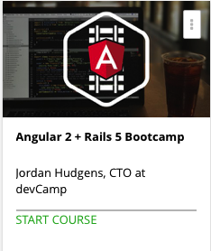

```
Roberto Nogueira  
BSd EE, MSd CE
Solution Integrator Experienced - Certified by Ericsson
```
# Angular 2 and Rails 5 Bootcamp



**About This Course**

Learn how to build a real world Angular 2 application that utilizes multiple Ruby on Rails apps for backend data APIs.

[Homepage](https://www.udemy.com/angular-on-rails-course/learn/v4/overview)

## Topics
```
0 / 5
Project Introduction
1. The Angular + Rails Application We're Going to Build 4:22
2. Application Architecture for an Angular + Rails Application 8:22
3. Monolith vs Microservice Architecture Deep Dive 10:33
4. The Role of Services in Microservice Architecture 8:32
5. The Role of Components in Microservices 6:55

Section: 2
0 / 2
System configuration for Angular 2 Application
6. Configuring a System to Run Angular 2 Applications 4:25
7. Generating an Angular 2 Application from Scratch 13:22

Section: 3
0 / 4
Angular 2 Development
8. Hello Angular 2 23:05
10. Creating the App Component 11:56
11. Introduction to Angular 2 Routing 14:59
12. How to Create View Files in Angular 2 5:11

Section: 4
0 / 5
Building the Document Management Component
13. Create a Document Management Component 7:28
14. Creating Links Between Pages in Angular 5:51
15. Creating an Angular Interface to Model Data 3:01
16. Creating Mock Data in an Angular 2 Application 14:07
17. How to Access Component Data from an Angular View Template 4:29

Section: 5
0 / 9
Building the Proposal Component
18. Creating the Initial Proposal Component 7:25
19. Creating an Angular 2 Data Model for Proposals 6:26
20. Populating an Angular List View with Data 10:31
21. Building an Angular 2 Component that will Create New Proposals 9:49
22. Introduction to Angular 2 Forms 11:01
23. Completing the Angular Proposal Form 18:28
24. How to Implement Dynamic Data Validations in Angular 2 11:44
25. Creating Dynamic Routes in Angular 2 Based on an ID Lookup 7:57
26. How to Trigger 'Active' Classes in Angular 2 Views 13:15

Section: 6
0 / 15
Integrating Bootstrap 4 in an Angular 2 Application
27. Installing Bootstrap 4 into an Angular 2 Application with ng-bootstrap 7:00
28. How to Set Universal Styles in an Angular 2 Application 1:46
29. Creating a Bootstrap 4 Navigation Bar 14:06
30. How to Dynamically Add CSS Classes in an Angular 2 View 8:41
31. Using Bootstrap Cards in an Angular Application 8:16
32. Creating Angular 2 Component Specific CSS Files 7:28
33. Setting Additional Global Styles for All Application Components in Angular 2 3:30
34. How to Override the Default Bootstrap 4 Navigation Styles 7:26
35. Adding Styles to an Angular 2 Form 8:59
36. How to Style Dynamic Validation Messages in Angular 2 5:49
37. How to Style Form Inputs with Bootstrap 4 Styles 4:49
38. How to Integrate the List Group Component Styles in Angular 2 12:12
39. How to Work with Angular 2 Pipes to Format Currencies 4:38
40. Final Style Changes to Angular Application 5:11
41. How to Add a Custom Font to an Angular 2 Application 2:22

Section: 7
0 / 3
Creating a Ruby on Rails Microservice to Manage Documents
42. Generating a Rails 5 API Application from Scratch
10:01
 Source code
43. How to Generate Data in a Rails 5 Application
8:34
 Source code
44. How to Configure the Network Settings for a Rails API App
4:10
Section: 8
0 / 4
Connecting the Angular Front End with the Rails Document API App
45. Creating an Angular 2 Service for Managing API Data
6:48
46. Introduction to Angular 2 Observables
18:18
47. How to Render API Data in an Angular 2 Application
16:04
49. Final Style Changes to Angular 2 Document Component
2:35

Section: 9
0 / 2
Creating the Proposal Ruby on Rails Microservice API Application
50. Building a Rails 5 API Microservice 2:29
51. Using the Seeds File to Create Sample Data in a Rails 5 API App 12:26

Section: 10
0 / 5
Connecting the Angular 2 App with the Rails Proposal Microservice
52. Using an Angular 2 Observable to Stream Live Data for the Proposal List Componen 16:07
53. How to Implement an Angular 2 Show Page Component with API Data 19:18
54. How to Build a Custom Link Function in an Angular 2 Component 4:54
55. Creating an Angular 2 Form Submit Button 9:01
56. How to Create New Records in a Rails API from an Angular App 18:06

Section: 11
0 / 6
Final Application Changes
58. Adding Final Style Changes to the Proposal Show Component 1:38
59. How to Trigger Sending Emails from the Rails Microservice 13:51
9. Working with Browser Sync 7:07
48. Analyzing Real Time Data Updates with an Angular + Rails System 4:49
57. How to Add Dynamic Notifications in an Angular 2 Application 5:02
60. Angular 2 + Rails 5 Bootcamp Course Summary 1:57
```
